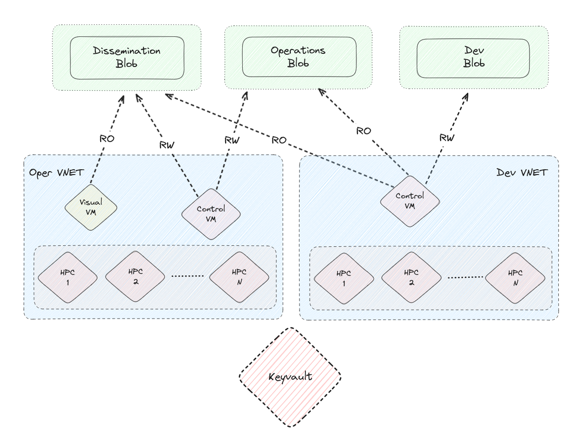
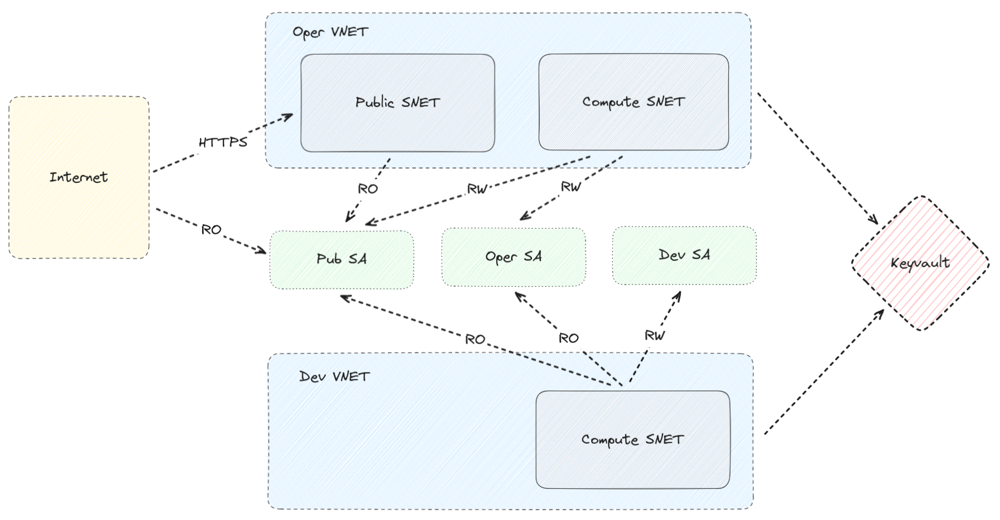
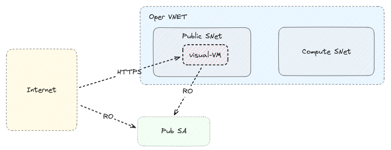
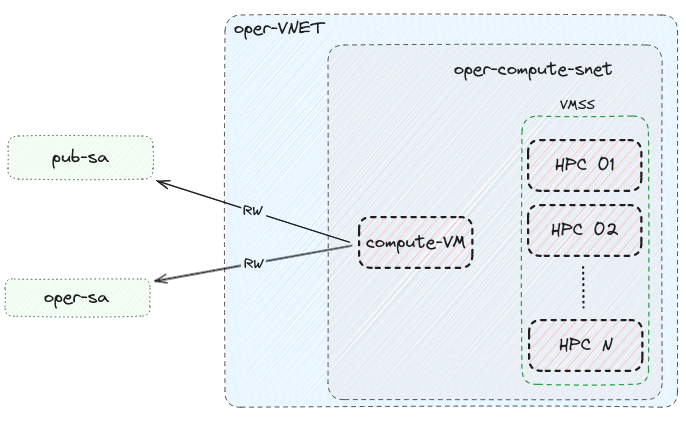

# Infrastructure

## Quick start

1. Determine the Azure Subscription ID and the correct Tenant ID for your subscription using these
    [instructions](https://learn.microsoft.com/en-us/azure/azure-portal/get-subscription-tenant-id)
1. Login to Entra ID with azure-cli. The tenant UUID is the one you determined in step 1. E.g.:
```bash
az login --tenant 1647eb98-698c-4714-b3b5-8cc15f794d36
```
1. Ensure that everything worked as expected:
``` bash
az account show
```
1. Enter the `infra` directory:
``` 
cd infra
```
1. Edit the `main.bicepparam` file and fill in appropriate values to it.
   At the very least you should change `project` and the SSH public key value.
   You can identify the principal IDs by using a command like this:
   ```
    az ad user show --id 'George.Breyiannis.ec.europa.eu#EXT#@europeancommissionhotmai379.onmicrosoft.com'
   ```

1. Deploy the infrastructure with the following command (it requires confirmation):
```
az deployment sub create -c --template-file main.bicep --parameters main.bicepparam
```

After a couple of minutes everything should be up and running.

<!-- ## High level design -->
<!---->
<!--  -->

## Design

The high level diagram of the infrastructure can be seen in the following image.



### Networking and Security

When it comes to networking, the important points are:

- There are two VNets, `oper` and `dev`. Communication between the VNets is not permitted.
- There is a Keyvault for storing secrets. The Keyvault is only accessible from within the VNets.
- The `oper` VNet has two Subnets: `public` which is accessible from the internet and `compute` where the HPC cluster is running.
  Direct communication between the two Subnets is not permitted. 
  If the VMs of the `public` subnet need data they should read them from the storage account where the VMs of the `compute` subnet wrote them to.
- The `dev` VNet only has the `compute` subnet. 

### Storage

As we can see there are 3 Storage Accounts: 

- `pub-sa` where the operational cluster stores the data that are meant to be disseminated to 3rd parties
- `oper-sa` where the operational cluster stores that data that are needed for its operation
- `dev-sa` where the development cluster stores that data that are needed for its operation

It should be noted that:

- The operational cluster does not have access to `dev-sa`
- The development cluster has RO only access to `pub-sa` and `dev-sa`. 
  The idea is that if there is any issue with the model output, the developers of the model should be able to access the data 
  in order to debug it. The same is true for input data. You probably only want to store them once in `oper-sa`

### Public Subnet

In the current implementation the `Public SNet`  is very simple. It has just a single VM which is being used to read data from 
`pub-sa` and visualize them via a web-app.

!!! note
    
    The actual deployment of the web application is omitted since it is implementation specific.



### Compute Subnet



## Naming conventions

This naming convention is intended to bring uniformity and predictability to resource deployment and management.
It supports efficient searching, sorting, and automation processes, 
making it easier for users and systems to navigate our Azure infrastructure.

This section explains the structure of the naming convention and the rationale behind it 
to help users understand how to locate and identify Azure resources within the system.

### Naming Structure

The general pattern for naming Azure resources is as follows:

```
{project}-{environment}-{domain}-[{identifier}-]{resource_suffix}
```

Each segment of the naming pattern plays a specific role:

- `{project}`: This is the project identifier, a shorthand for the project or application to which the resource belongs.
  Please keep it short (3-5 chars) since Azure has relatively short limits for Storage Accounts names.

- `{environment}`: Resources are categorized by the environment they reside in.
  The environments we make use of are `dev` for development and `oper` for operational or production.
  There is also the `common` environment which contains resources that are not environment-specific
  (e.g. Keyvault and Storage accounts).

- `{domain}`: This denotes the functional area or service that the resource is a part of,
  such as `net` for network-related resources, `storage` for storage-related resources etc.

- `{identifier}`: Used when there are multiple similar resources that need differentiation, 
  such as two subnets or network security groups within the same `domain`. 
  For example, `public` and `compute` are identifiers that help distinguish between different subnets.

- `{resource_suffix}`: This is a short code that represents the type of Azure resource.

### Special Considerations

Due to Azure requirements, Storage Account names cannot contain hyphens and must be globally unique. 
With the naming pattern we use you shouldn't run into duplicates, but in the rare chance that you do
try to use a different value in `project`.

### List of suffixes

The suffixes that we make use of are:

- `rg` for Resource Groups
- `vm` for Virtual Machines
- `vmss` for Virtual Machine Scale Sets
- `vnet` for Virtual Networks
- `snet` for Subnets
- `nsg` for Network Security Groups
- `kv` for Keyvaults
- `sa` for Storage Accounts
- `nic` for Network Interfaces
- `pip` for Public IP Addresses

## Resources and Resource groups

### List of `ResourceGroups`

After deployment you should end up with the following Resource Groups:

``` bash
$ PROJECT=aaa
$ az group list --query "[?starts_with(name, '${PROJECT}')].name" --output table
aaa-common-keyvault-rg
aaa-common-storage-dev-rg
aaa-common-storage-oper-rg
aaa-common-storage-pub-rg
aaa-dev-compute-rg
aaa-dev-network-rg
aaa-oper-compute-rg
aaa-oper-network-rg
aaa-oper-visual-rg
```

### List of `Resources`

After deployment you should end up with the following Resources:

``` bash
$ PROJECT=aaa
$ az resource list --query "[?starts_with(name, '${PROJECT}')].name" --output tsv | sort
```
